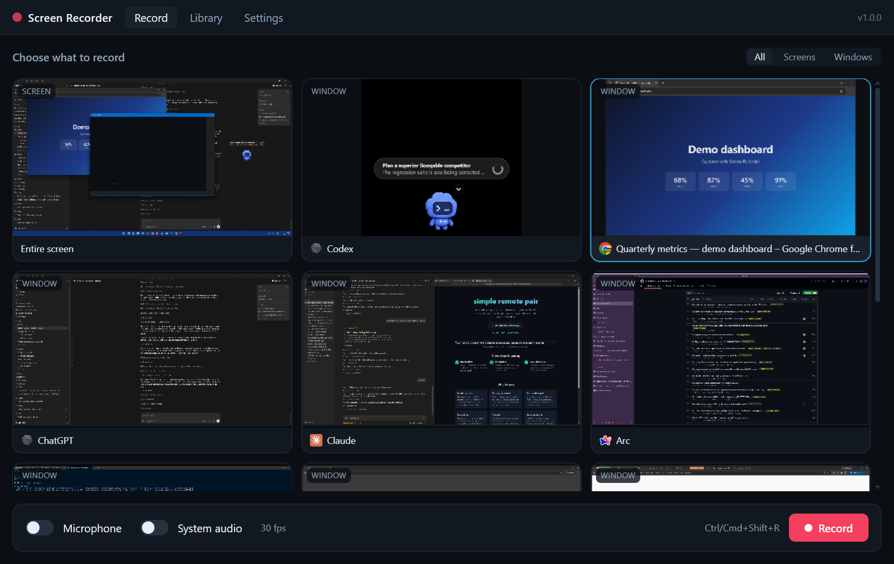
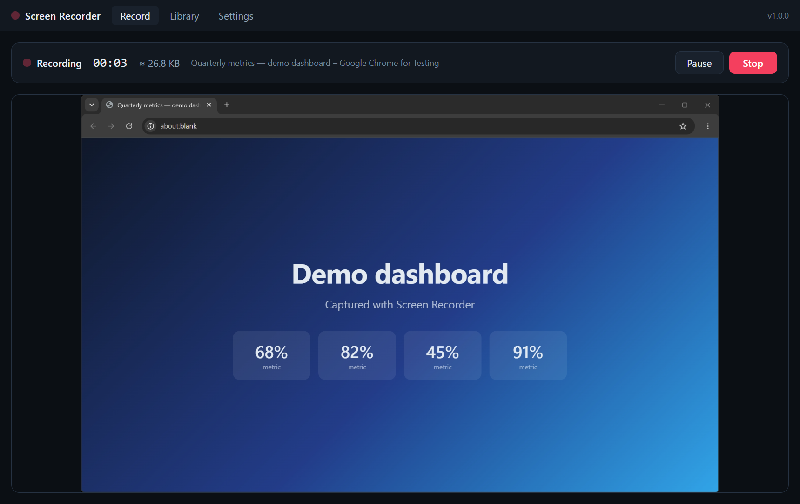
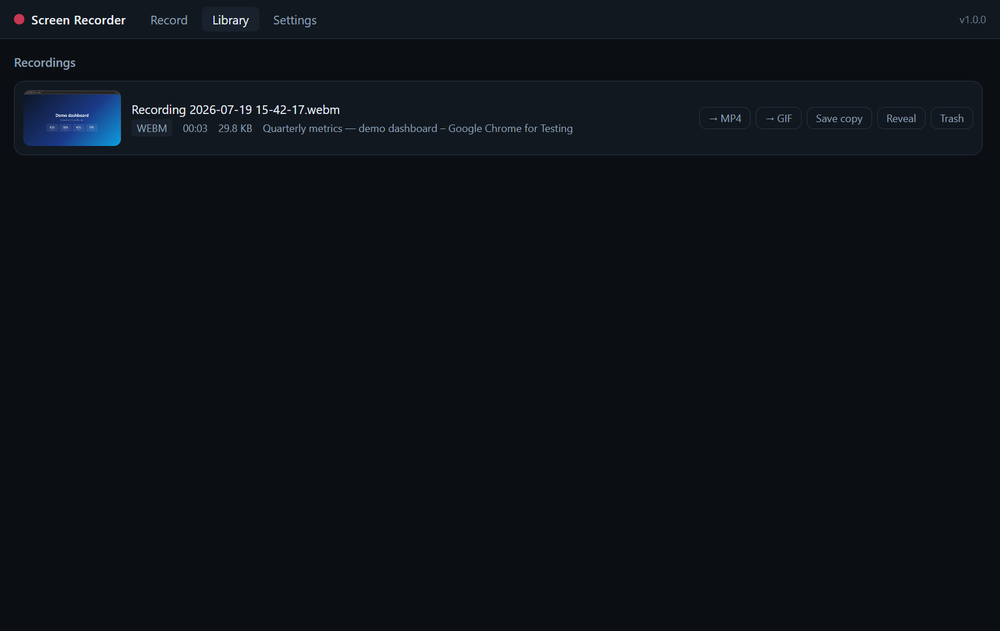
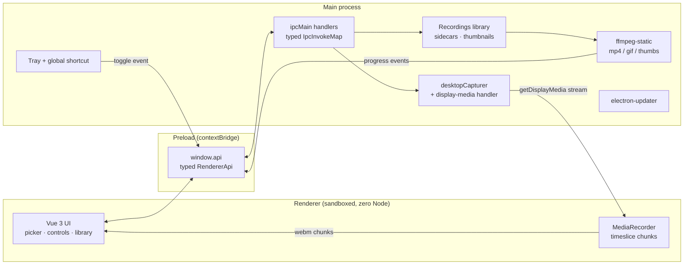

# Screen Recorder

Small, secure screen recorder for macOS, Windows, and Linux — source picker with live thumbnails, mp4/gif export with real ffmpeg, tray control, and auto-updates.

[](https://github.com/jeeanribeiro/electron-screen-recorder/actions/workflows/ci.yml)
[](https://github.com/jeeanribeiro/electron-screen-recorder/releases/latest)
[](LICENSE)



## Download

[](https://github.com/jeeanribeiro/electron-screen-recorder/releases/latest)
[](https://github.com/jeeanribeiro/electron-screen-recorder/releases/latest)
[](https://github.com/jeeanribeiro/electron-screen-recorder/releases/latest)

Grab the installer for your OS from the [latest release](https://github.com/jeeanribeiro/electron-screen-recorder/releases/latest). Builds are unsigned community builds: macOS needs right-click → Open on first launch, Windows shows a SmartScreen prompt. Details in [RELEASING.md](RELEASING.md).

## Features

- **Source picker with live thumbnails** — every screen and window, refreshed while you choose, with app icons and a screens/windows filter.
- **Real recording controls** — pause/resume, elapsed timer, live size estimate, global shortcut (`Ctrl/Cmd+Shift+R`), and tray start/stop.
- **Audio** — microphone toggle, plus system audio via OS loopback where the platform supports it (matrix below). Mic + system audio are mixed into a single track through an `AudioContext`.
- **WebM instantly, mp4/gif for sharing** — recordings are saved as WebM with zero re-encode; one click converts to H.264 mp4 or palette-optimized GIF with a real progress bar (ffmpeg via [`ffmpeg-static`](https://github.com/eugeneware/ffmpeg-static), progress streamed over IPC).
- **Recordings library** — ffmpeg-generated thumbnails, duration/size/source metadata, reveal-in-folder, save-a-copy, and trash (never hard-delete).
- **Auto-updates** — electron-updater wired to GitHub Releases (per-OS caveats for unsigned builds documented in [RELEASING.md](RELEASING.md)).

| Recording                                        | Library                                        |
| ------------------------------------------------ | ---------------------------------------------- |
|  |  |

## Security architecture

Most Electron screen-recorder samples run with `nodeIntegration: true` and a preload that pokes functions onto `window`. This app is built the other way around:

- **`contextIsolation: true` + `sandbox: true`, `nodeIntegration: false`** — the renderer is a plain web page with zero Node access. The Playwright smoke test asserts that `require`, `process`, and `Buffer` do not exist in the renderer.
- **One typed IPC contract** — [`src/shared/ipc.ts`](src/shared/ipc.ts) declares every channel with its payload and response types. The main process implements `IpcInvokeMap`; the sandboxed preload exposes a matching [`RendererApi`](src/shared/api.ts) via `contextBridge`. A handler or call that drifts from the contract fails to compile.
- **Capture is brokered, never exposed** — the renderer sees serialized source snapshots (name + thumbnail data URL). Picking one registers a _one-shot_ selection in the main process; `getDisplayMedia()` is resolved by a `setDisplayMediaRequestHandler` that attaches the matching source. Source ids never grant capture by themselves.
- **Strict CSP** — `default-src 'self'`, no remote code, no `eval`, media limited to `blob:`. The dev server only widens `connect-src` for HMR.
- **Locked-down session** — permission handlers allow exactly `media` and `display-capture`; every `window.open` and navigation is denied (https links go to the system browser).
- **Defensive IPC inputs** — recording ids from the renderer are validated against the library directory (no traversal), settings are normalized field-by-field, deletes go to the OS trash.

## System audio support

| OS      | System audio | Notes                                                                                                    |
| ------- | ------------ | -------------------------------------------------------------------------------------------------------- |
| Windows | ✅           | OS loopback capture, no extra software                                                                   |
| macOS   | ❌           | Not available to unsigned apps without a virtual audio driver (e.g. BlackHole); microphone capture works |
| Linux   | ❌           | Depends on PipeWire/PulseAudio setup; not reliable enough to advertise — microphone capture works        |

The app detects this at runtime and disables the toggle rather than failing silently.

## Quickstart (from source)

```sh
git clone https://github.com/jeeanribeiro/electron-screen-recorder.git
cd electron-screen-recorder
pnpm install
pnpm dev
```

Node 24+ and pnpm 10 (`corepack enable`).

## Architecture



The shared contract in `src/shared/` is the only thing all three layers import — channel names, payload types, ffmpeg argument builders, and settings validation live there, framework-free and unit-tested.

### Why Electron (and not Tauri)?

This app _is_ the Chromium capture stack: `desktopCapturer`, `getDisplayMedia`, `MediaRecorder`, and OS loopback audio are first-class in Electron and portable across all three desktop platforms. A Tauri port was considered and rejected — screen capture there means reimplementing per-OS capture and encoding natively, which is exactly the wheel this project doesn't want to reinvent. The trade-off (bundle size) is real; the capture reliability is worth it.

## Development

| Command                        | What it does                                               |
| ------------------------------ | ---------------------------------------------------------- |
| `pnpm dev`                     | electron-vite dev server + Electron with HMR               |
| `pnpm lint` / `pnpm typecheck` | ESLint flat config / `tsc` + `vue-tsc` strict              |
| `pnpm test`                    | Vitest unit tests (shared contract, ffmpeg args, settings) |
| `pnpm build && pnpm test:e2e`  | Playwright smoke test against the real built app           |
| `pnpm package`                 | electron-builder installers for the current OS             |
| `pnpm icons`                   | regenerate the programmatic icon set (zero image deps)     |
| `pnpm screens`                 | re-capture README screenshots with Playwright              |

## Roadmap

- Area/region capture
- Webcam overlay bubble
- Configurable shortcut
- Per-recording rename in the library

## Contributing

Issues and PRs welcome — see [CONTRIBUTING.md](CONTRIBUTING.md). Please keep the renderer sandboxed; new IPC goes through the typed contract.

## License

[MIT](LICENSE) © Jean Ribeiro

## Credits

Originally scaffolded from the [electron-vite-vue](https://github.com/electron-vite/electron-vite-vue) template by [草鞋没号](https://github.com/caoxiemeihao) — the current architecture has since been rebuilt on [electron-vite](https://electron-vite.org/).
